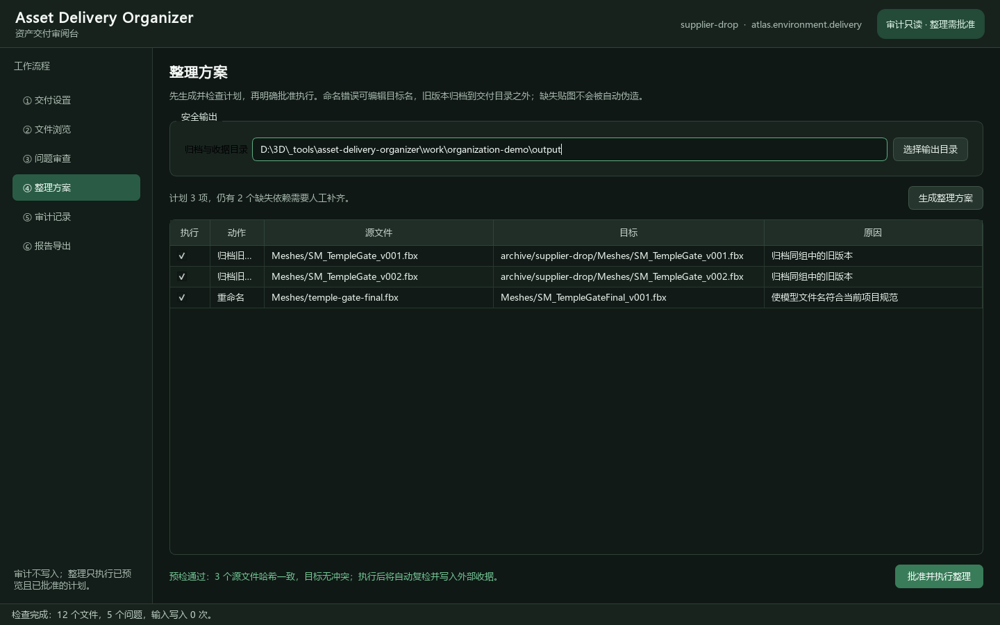
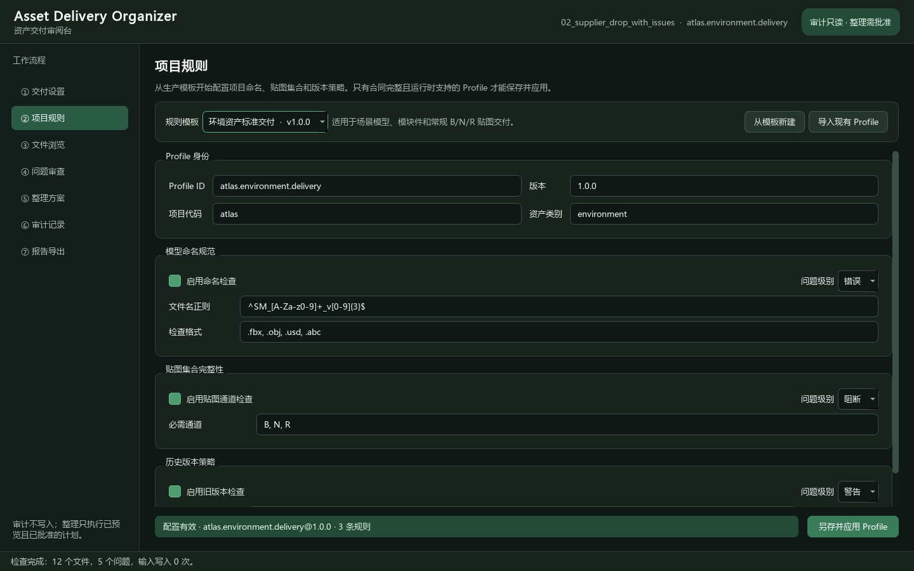
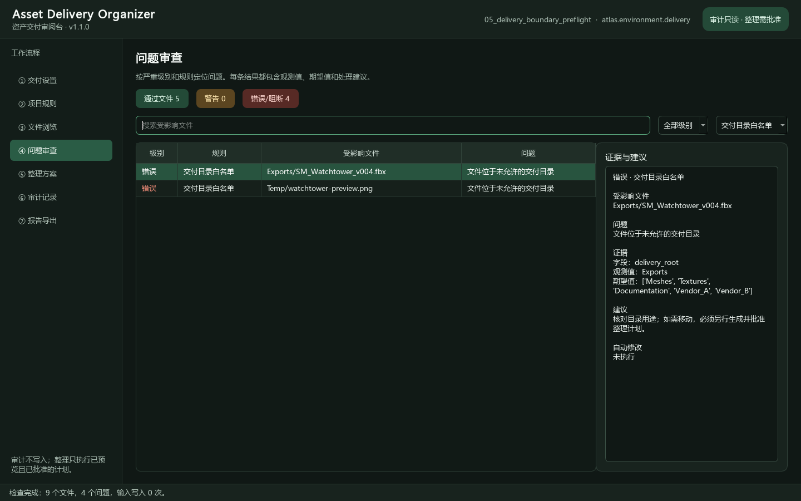
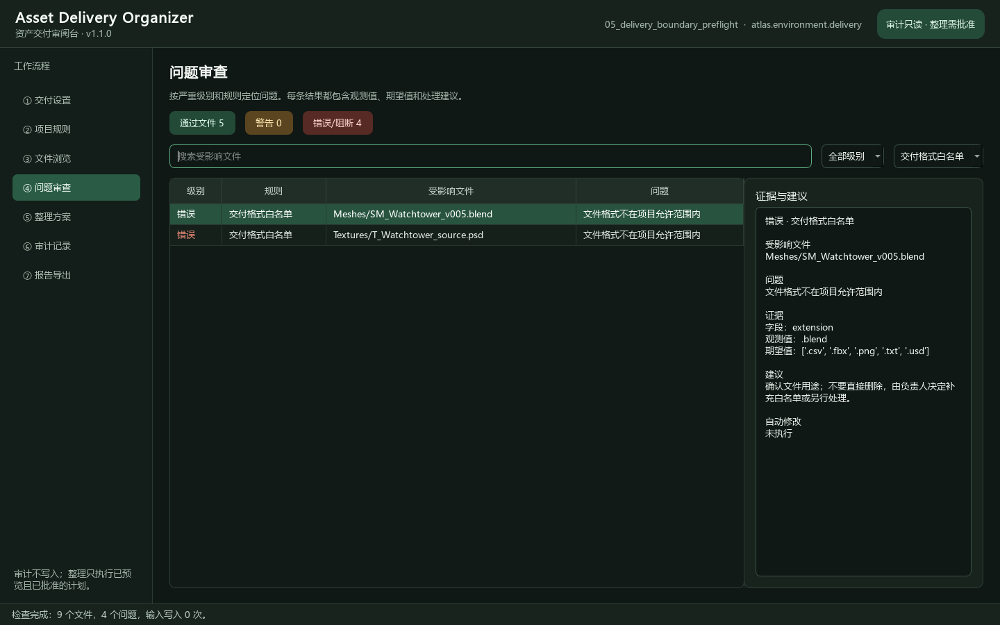
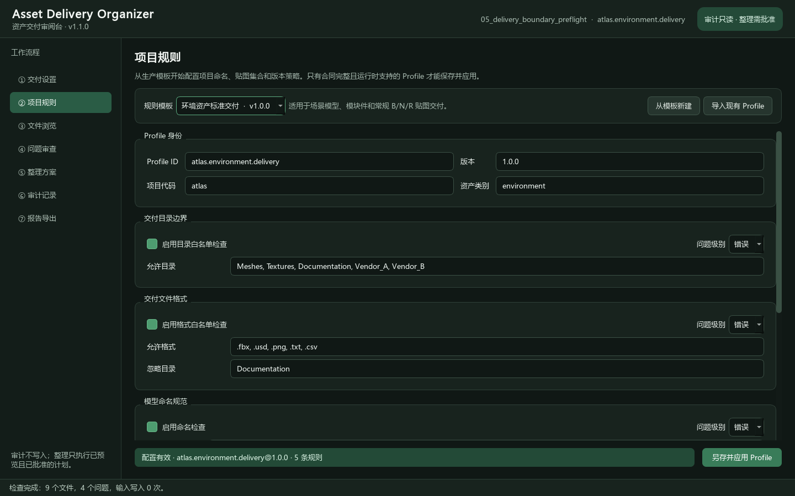
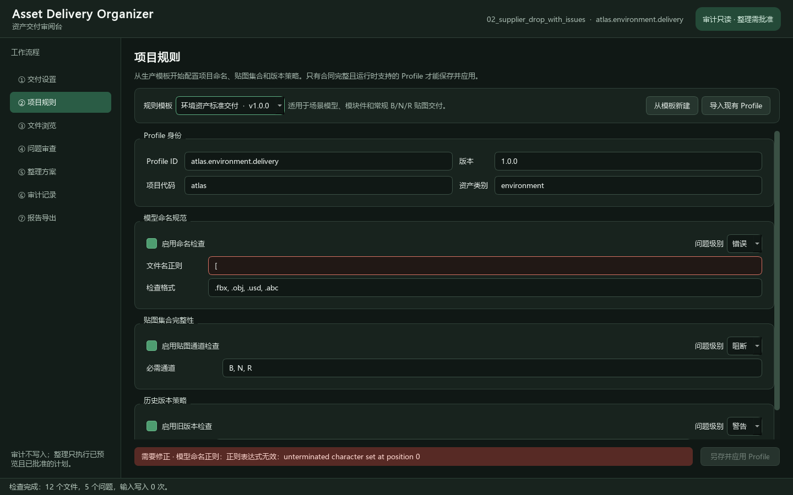
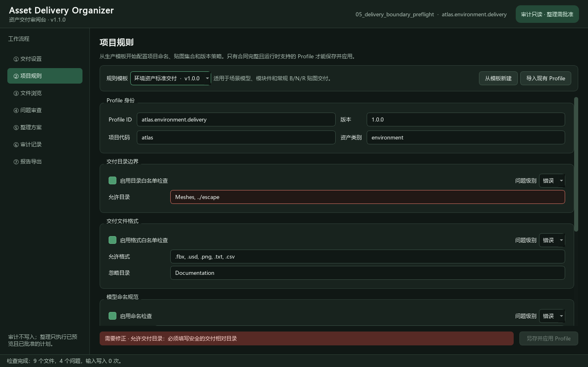
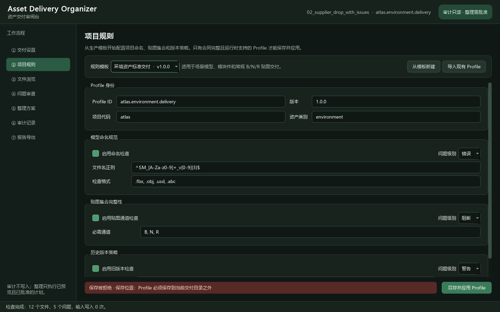
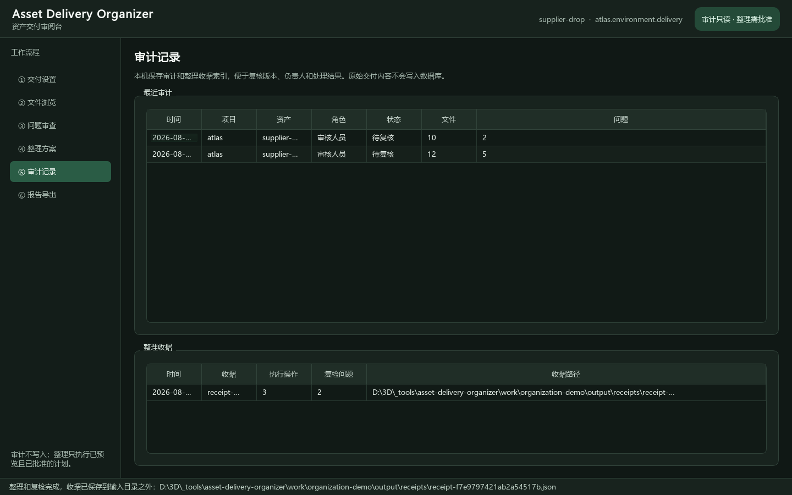
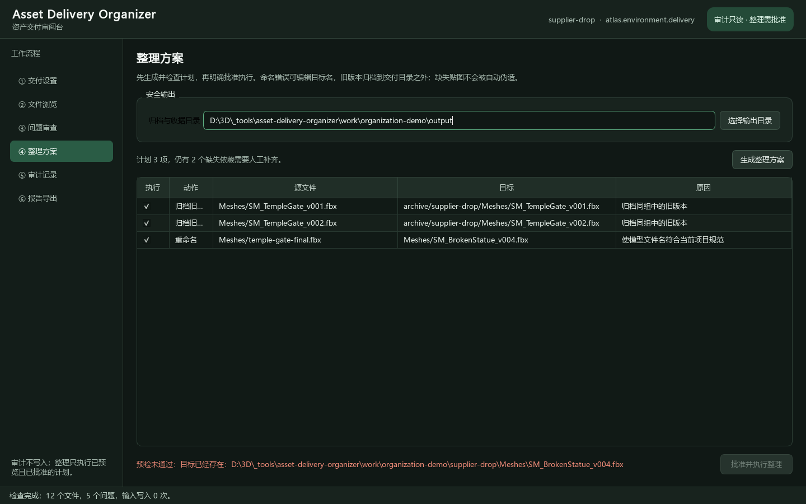

# Asset Delivery Organizer

面向技术美术、外包供应商和资产审核人员的中文资产交付工作台。它把可视化项目规则、交付信息、文件扫描、命名与贴图检查、安全整理、版本归档、复检收据和历史记录放进同一个桌面工具，同时保留 CLI/API 给 Skill、Agent 与 CI 调用。



## 为什么需要它

一批真实交付通常同时包含模型、贴图、UDIM、历史版本和供应商说明。人工检查容易漏掉错误命名、缺失通道和旧版本；直接批量改名或移动又可能覆盖文件、破坏引用或在失败后留下半成品。

本工具将操作拆成两个安全阶段：

- **审计阶段严格只读**：生成稳定文件事实和可解释问题证据；
- **整理阶段必须批准**：先生成可编辑 dry-run 方案，再复核哈希与目标冲突，执行失败逆序回滚，完成后重新审计并保存外部收据。

## 七个工作区

1. **交付设置**：选择目录、Profile、角色、公司/人员/项目/资产代码、制作阶段和审核状态；
2. **项目规则**：从环境/角色模板创建 Profile，导入、编辑、即时校验并安全另存；
3. **文件浏览**：按名称、类型和问题状态筛选，查看 SHA-256、解析字段、图片与文本预览；
4. **问题审查**：按严重级别与规则定位错放目录、禁用格式、命名错误、缺失贴图和旧版本；
5. **整理方案**：生成可编辑计划，重命名不合规模型，将旧版本归档到交付目录之外；
6. **审计记录**：本机记录审计历史、负责人、状态、执行收据和复检结果；
7. **报告导出**：输出标准 `art-delivery-audit-report/1` JSON。







## 当前能力

- PySide6 中文桌面应用，高 DPI 中文字体回退，1440×900 与 1080×680 验收；
- 环境资产和角色资产两套版本化 Profile 模板，无需手写 JSON 即可开始；
- Profile 导入、字段级即时校验、原子另存与应用，禁止保存到被审计交付目录；
- Profile 或本次启用规则变化后，旧审计和旧整理计划自动失效；
- 五条可版本化确定性规则：目录白名单、文件格式白名单、命名正则、贴图通道完整性和仅保留最新版本；
- `path.allowed-roots@1.0.0` 使用可移植相对路径证据定位错放目录；
- `file.allowed-extensions@1.0.0` 支持扩展名白名单与可选忽略目录；
- 递归扫描、稳定相对路径、SHA-256、媒体类型和命名 token；
- Unicode/大小写路径冲突、路径穿越、符号链接逃逸、扫描中途变化和资源预算防线；
- 可选择本次启用规则，不需要修改项目 Profile；
- PNG/JPG/BMP 预览，TXT/MD/CSV/JSON/USD/OBJ/MA/ASCII FBX 文本预览；
- dry-run 整理方案，可取消操作并编辑目标路径；
- 全量源哈希复检、目标存在检查、重复源/目标检查和目录边界检查；
- 重命名与外部旧版本归档；
- 失败逆序回滚、执行后重新审计、外部 JSON 收据；
- SQLite 本机审计/收据索引，不保存资产内容；
- 桌面、CLI、Python API 共用同一业务核心和合同。

## Windows 免 Python 安装

普通用户直接从 [v1.1.0 Release](https://github.com/Ubik42/asset-delivery-organizer/releases/tag/v1.1.0) 下载 `AssetDeliveryOrganizer-1.1.0-windows-x64.zip`：

1. 核对 ZIP 的 SHA-256：`f71a313339041ba38d6710260f8618029d94c25a85283998ff3ea0f3077f61cf`；
2. 完整解压，不要直接在压缩包里运行；
3. 双击 `AssetDeliveryOrganizer.exe`。

不需要安装 Python或克隆仓库。当前发行物未商业代码签名，Windows 可能显示未知发布者；完整安装、升级、卸载和数据保留说明见 [Windows 可移植版指南](docs/WINDOWS_PORTABLE_INSTALL.md)。


## 源码开发安装

支持 Windows 与 Python 3.11+：

```powershell
git clone https://github.com/Ubik42/asset-delivery-organizer.git
cd asset-delivery-organizer
python -m venv .venv
.\.venv\Scripts\python.exe -m pip install -e ".[ui,dev]"
```

启动桌面工具：

```powershell
.\.venv\Scripts\ado-ui.exe
```

首次体验可直接使用仓库中的合成项目，详见 [中文使用教程](docs/USER_GUIDE.md)。

### 不手写 JSON 创建项目规则

进入“项目规则”，选择“环境资产标准交付”或“角色资产标准交付”，点击“从模板新建”。填写项目代码、Profile ID、版本、允许目录、允许格式、格式忽略目录、命名正则、贴图通道和保留版本数；底部显示“配置有效”后，另存到交付目录之外并应用。





无效字段会变红并说明具体原因，保存按钮同时禁用。保存后的 Profile 仍是严格 `art-delivery-profile/1` JSON，可继续被桌面、CLI、Skill 和 CI 共用。

目录穿越配置同样会立即阻断，不会等到扫描时才失败：



尝试把 Profile 写入当前交付目录时，工具会在产生文件之前拒绝：



## 最短演示路径

准备一份允许修改的演示副本：

```powershell
.\demo\prepare-organization-demo.ps1
.\.venv\Scripts\ado-ui.exe
```

在“交付设置”中选择：

- 交付目录：`work\organization-demo\supplier-drop`
- Profile：`profiles\atlas.environment.delivery.json`
- 归档与收据目录：`work\organization-demo\output`

扫描后预期得到 12 个文件、5 个问题。进入“整理方案”生成 3 项计划：

- 归档 `SM_TempleGate_v001.fbx`
- 归档 `SM_TempleGate_v002.fbx`
- 将 `temple-gate-final.fbx` 重命名为 `SM_TempleGateFinal_v001.fbx`

2 个缺失贴图问题不会被自动伪造，执行与复检后仍保留为人工问题。



## 安全整理为什么可信

```text
扫描报告
  → 生成 dry-run 计划
  → 用户编辑/取消操作
  → 源路径与 SHA-256 全量复检
  → 目标边界与冲突全量复检
  → 用户明确批准
  → 执行重命名/外部归档
  → 失败则逆序回滚
  → 重新扫描
  → 在交付目录外写入收据
```

当目标已经存在时，执行按钮会被禁用：



审计本身永远不写入输入目录。整理只执行表格中已勾选、已经预览且预检通过的操作；不会静默覆盖，也不提供删除动作。

## 自动化接口

只读审计：

```powershell
ado D:\deliveries\supplier-drop `
  --profile .\profiles\atlas.environment.delivery.json `
  --output D:\audit-output\supplier-drop.json
```

生成整理方案，不执行文件修改：

```powershell
ado-organize plan D:\deliveries\supplier-drop `
  --profile .\profiles\atlas.environment.delivery.json `
  --output-root D:\delivery-archive
```

执行方案时，必须把输出中的 `plan_id` 原样填入批准参数：

```powershell
ado-organize execute D:\delivery-archive\plans\plan-xxxxxxxx.json `
  --profile .\profiles\atlas.environment.delivery.json `
  --approve plan-xxxxxxxx
```

如果源文件、Profile 或目标状态在生成方案后发生变化，执行会失败关闭并要求重新生成计划。

## 演示素材

仓库包含 5 组不可变合成场景，共 109 个文件：

| 场景 | 文件 | 问题 | 重点 |
| --- | ---: | ---: | --- |
| `01_clean_environment_delivery` | 16 | 0 | 合规命名、完整 B/N/R、双 UDIM |
| `02_supplier_drop_with_issues` | 12 | 5 | 错误命名、缺失通道、两个旧版本 |
| `03_multi_asset_udim_batch` | 58 | 0 | 8 个资产、48 张 UDIM 贴图 |
| `04_nested_multi_vendor_batch` | 14 | 3 | 嵌套目录、多供应商 |
| `05_delivery_boundary_preflight` | 9 | 4 | 错放目录、禁用格式、忽略文档目录 |

素材由固定脚本生成并采用 CC0-1.0。整理演示永远先复制到被 Git 忽略的 `work/`，不会修改 `demo/scenarios`。路径、大小和哈希见 [素材清单](demo/assets-manifest.json)。

## 架构

```text
PySide6 Desktop ─┐
CLI / CI ────────┼─→ Contracts + Scanner + Rules
Python / Skill ──┘          │
                            ├─→ Audit Report
                            ├─→ Organization Plan
                            ├─→ Transaction + Rollback
                            ├─→ Post Audit + Receipt
                            └─→ Local History Index
```

核心不导入 Maya、Unreal 或其他 DCC SDK。未来宿主能力只通过薄 Adapter 接入，不复制桌面业务逻辑和界面。

## 验证

```powershell
.\scripts\validate.ps1 -Tier quick
.\demo\run-demo.ps1 -Verify
.\scripts\release_audit.ps1
```

当前自动测试覆盖合同、扫描边界、五条规则、报告写入、五组素材、规则筛选与证据同步、Qt 工作台、整理生成、目标冲突、源哈希变化、成功执行、CLI 精确批准、模拟中途失败回滚、复检、收据与历史数据库。

Profile 工作区额外覆盖模板漂移、严格导入、重复规则、危险目录、重复格式、无效正则、重复通道、交付目录内保存拒绝、已有目标保护、保存后 CLI 重载和旧审计失效。

发布证据见 [1.1.0 发布审计](docs/RELEASE_AUDIT_1.1.0.md) 与 [M6 交付边界规则验收](docs/M6_DELIVERY_BOUNDARY_RULES_AUDIT.md)，完整录制流程见 [演示录制脚本](docs/VIDEO_TUTORIAL.md)。

## 当前边界

当前 `main` 分支为已验收的 1.1.0：包含独立资产交付能力、可视化 Profile 工作区、五条确定性规则和免 Python Windows 发行包。本项目不是对原 AutoSort 全部 DCC 内功能的复刻，以下能力不在本仓库中冒充完成：

- Maya/Arnold 材质节点网络写入；
- Maya、Blender、Houdini、3ds Max 内嵌面板；
- OBJ/FBX/USD 宿主级转换；
- 正式供应商权限和在线项目管理系统；
- 自动生成缺失贴图内容。

这些能力必须由真实 DCC 场景需求证明后，以薄 Adapter 或独立项目实现。

## 许可

- 代码：[MIT](LICENSE)
- 合成演示素材：CC0-1.0，见 [demo/LICENSE.md](demo/LICENSE.md)
