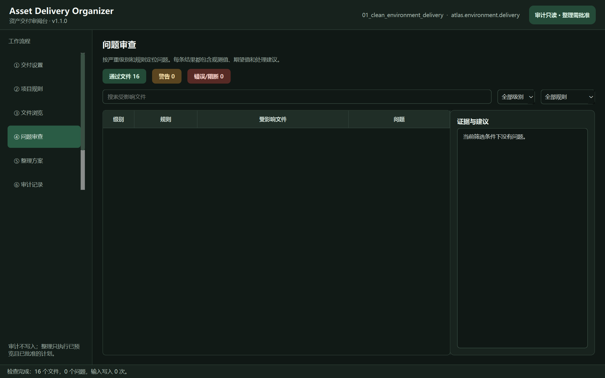

# 中文使用教程

## 1. 安装与启动

普通 Windows 用户下载 v1.1.0 ZIP，完整解压后双击 `AssetDeliveryOrganizer.exe`，无需 Python。发行物未商业代码签名，首次启动可能出现未知发布者提示；请从公开 Release 下载并核对 SHA-256。升级、卸载与历史数据保留见 [Windows 可移植版指南](WINDOWS_PORTABLE_INSTALL.md)。

源码开发方式：

```powershell
cd D:\3D\_tools\asset-delivery-organizer
python -m venv .venv
.\.venv\Scripts\python.exe -m pip install -e ".[ui]"
.\.venv\Scripts\ado-ui.exe
```

工作台包含交付设置、项目规则、文件浏览、问题审查、整理方案、审计记录和报告导出七个步骤。



## 2. 准备安全演示副本

`demo/scenarios` 是不可变测试夹具，不要直接整理。运行：

```powershell
.\demo\prepare-organization-demo.ps1
```

脚本把问题场景逐字节复制到 `work\organization-demo\supplier-drop`，并验证 12 个文件的 SHA-256。后续操作只针对这个可变副本。

## 3. 创建或编辑项目规则

第一次为项目建立规则时，不需要手写 JSON：

1. 进入“项目规则”；
2. 选择“环境资产标准交付”或“角色资产标准交付”；
3. 点击“从模板新建”；
4. 修改 Profile ID、版本、项目代码和资产类别；
5. 按项目约定填写允许交付目录、允许文件格式、格式忽略目录、模型命名正则、必需贴图通道和保留版本数；
6. 底部显示绿色“配置有效”后，点击“另存并应用 Profile”；
7. 保存到交付目录之外，例如项目管线仓库的 `profiles` 文件夹。

也可以点击“导入现有 Profile”载入严格 `art-delivery-profile/1` JSON。路径穿越、绝对目录、重复格式、无效正则、重复类别/通道、错误版本号、重复规则或没有启用任何规则时，会精确标出字段并禁用保存。

编辑区中的内容在保存前只是草稿。保存并应用或导入另一份 Profile 后，旧审计与旧整理计划会立即失效；这是为了避免按上一版规则继续移动文件，必须重新扫描。

## 4. 填写交付信息并扫描

在“交付设置”中：

1. 交付目录选择 `work\organization-demo\supplier-drop`；
2. Profile 选择 `profiles\atlas.environment.delivery.json`；
3. 填写角色、公司代码、人员代码、项目代码、资产代码、阶段和审核状态；
4. 确认目录白名单、格式白名单、命名规范、贴图通道完整性和仅保留最新版本五项已启用；
5. 点击“扫描并检查”。

预期：12 个文件、5 个问题，其中警告 2、错误 1、阻断 2。审计不写入输入目录。

## 5. 浏览文件与问题

“文件浏览”支持名称搜索、模型/贴图/文档筛选、只看有问题或只看通过文件。右侧显示相对路径、大小、媒体类型、解析字段、SHA-256 和内容预览。

“问题审查”可按严重级别和规则筛选。选择一行后查看：

- 受影响文件；
- 观测值与期望值；
- 中文处理建议；
- 是否允许生成计划。

要单独演示交付边界，扫描 `demo\scenarios\05_delivery_boundary_preflight`。预期 9 个文件、4 个错误：`Exports` 与 `Temp` 各产生一条目录问题，`.blend` 与 `.psd` 各产生一条格式问题；`Documentation/vendor_brief.docx` 因配置为忽略目录而通过。切换规则筛选器后，右侧证据必须同步显示当前行的观测值、白名单和中文建议。

缺失贴图不会自动生成；它始终保留为需要供应商补齐的阻断问题。

## 6. 生成并审阅整理方案

进入“整理方案”，归档与收据目录选择：

```text
work\organization-demo\output
```

点击“生成整理方案”。应出现 3 项：

- 两个旧版本归档到 `output\archive\supplier-drop\...`；
- 一个错误命名在原目录重命名；
- 两个缺失贴图问题显示为仍需人工补齐，不进入执行表。

可以取消任一操作，也可以编辑目标路径。每次修改都会即时重新预检。目标已存在、目标重复、路径逃逸或源文件哈希变化时，“批准并执行整理”会被禁用。

## 7. 执行、回滚和复检

点击“批准并执行整理”，核对确认框后继续。工具会：

1. 再次验证所有源文件路径和 SHA-256；
2. 再次验证目标边界和冲突；
3. 执行已勾选操作；
4. 任一步失败时逆序回滚已经完成的操作；
5. 成功后重新运行完整审计；
6. 在输出目录的 `receipts` 中写入 JSON 收据；
7. 在“审计记录”中显示整理前后结果。

预期整理后：10 个交付文件、2 个缺失贴图问题。旧版本位于外部归档，错误命名已变为 `SM_TempleGateFinal_v001.fbx`。

## 8. 导出报告

在“报告导出”中核对审计 ID、Profile、规则和统计，将 `art-delivery-audit-report/1` JSON 保存到交付目录之外。输入目录内部目标会被拒绝。

## 9. 自动化接口

只读审计使用 `ado`。安全整理分两步：

```powershell
ado-organize plan <delivery> --profile <profile.json> --output-root <external-output>
ado-organize execute <plan.json> --profile <profile.json> --approve <exact-plan-id>
```

第二条命令只有在 `--approve` 精确匹配方案 ID 时才执行。

## 10. 常见失败与恢复

- **Profile 无效**：修正 Profile 后重新扫描；
- **交付目录配置危险**：只能填写交付包内的可移植相对目录，不接受绝对路径或 `..`；
- **文件格式未允许**：确认文件用途后决定扩展白名单或忽略目录，不自动删除源文件；
- **Profile 无法保存**：查看底部字段错误；确认目标位于交付目录之外且已明确同意覆盖；
- **Profile 已变化**：旧报告和整理方案已经失效，使用新规则重新扫描；
- **没有启用规则**：至少启用一条规则；
- **目标已经存在**：编辑目标或取消该操作；
- **源文件已变化**：重新扫描并重新生成方案；
- **文件被 DCC 占用**：关闭占用或结束保存后重试；
- **执行中失败**：查看错误与回滚结果，重新扫描确认当前事实；
- **报告/归档目录在交付目录内**：改选独立外部目录；
- **界面依赖缺失**：运行 `pip install -e ".[ui]"`。

技术日志不会直接倾倒到主界面；所有可恢复失败都会说明哪些内容没有改变以及下一步操作。
